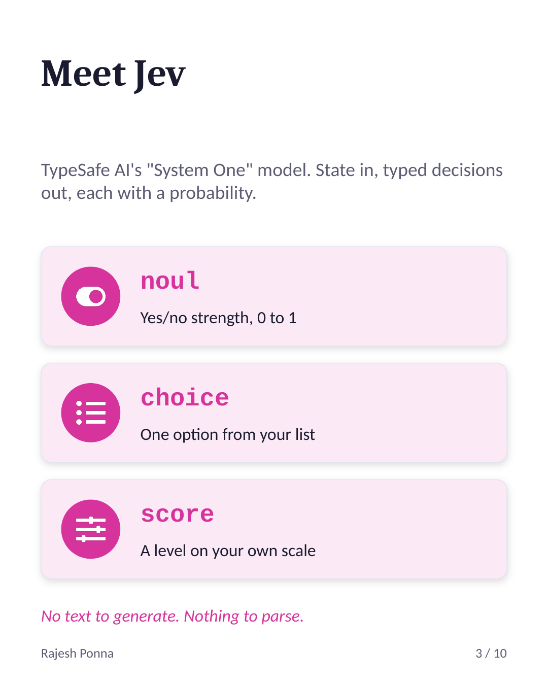
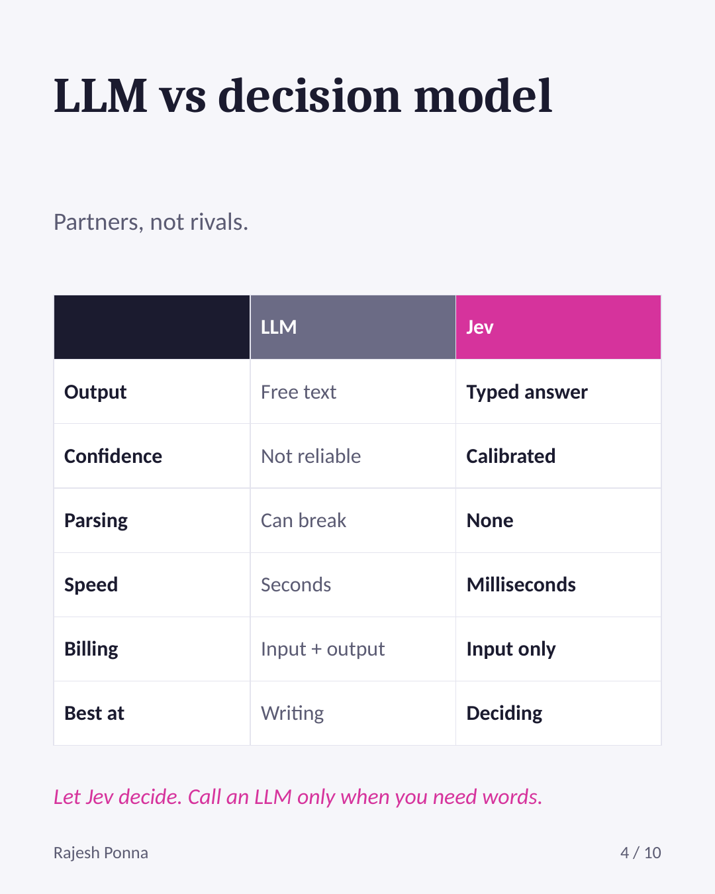
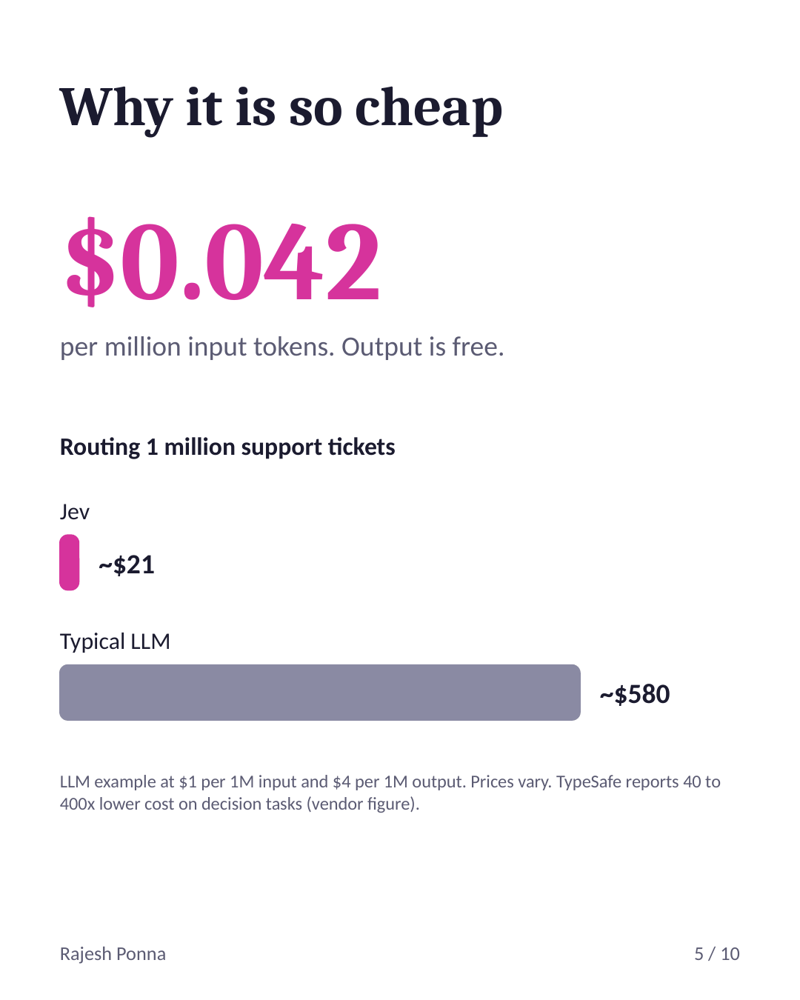
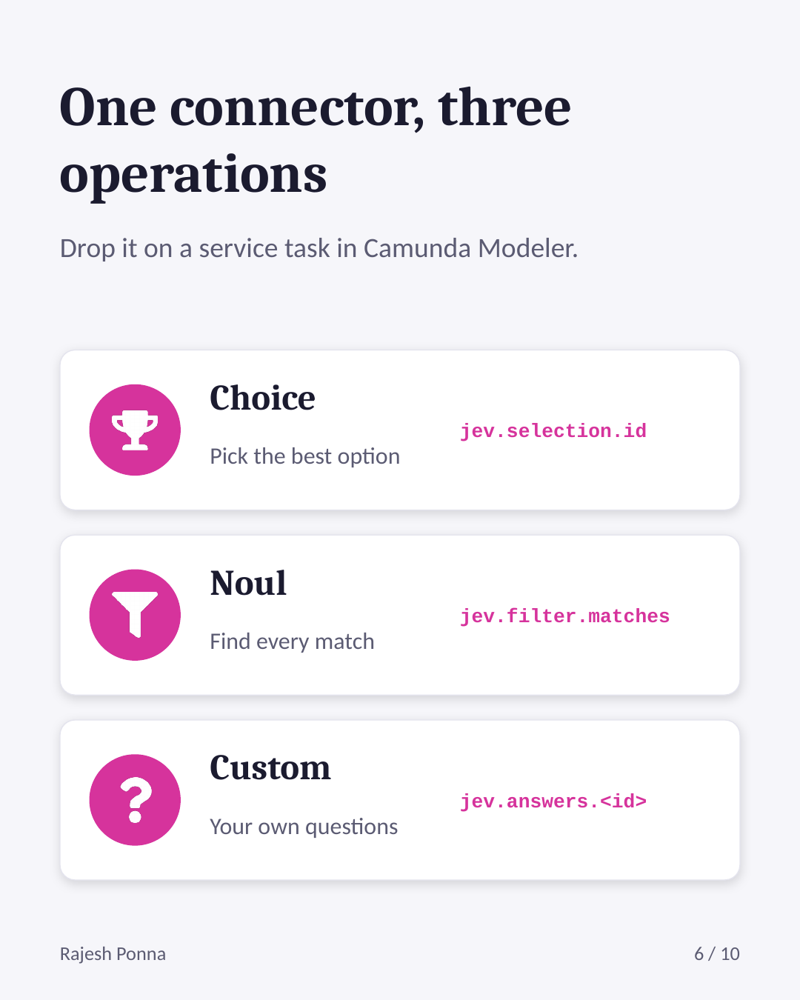
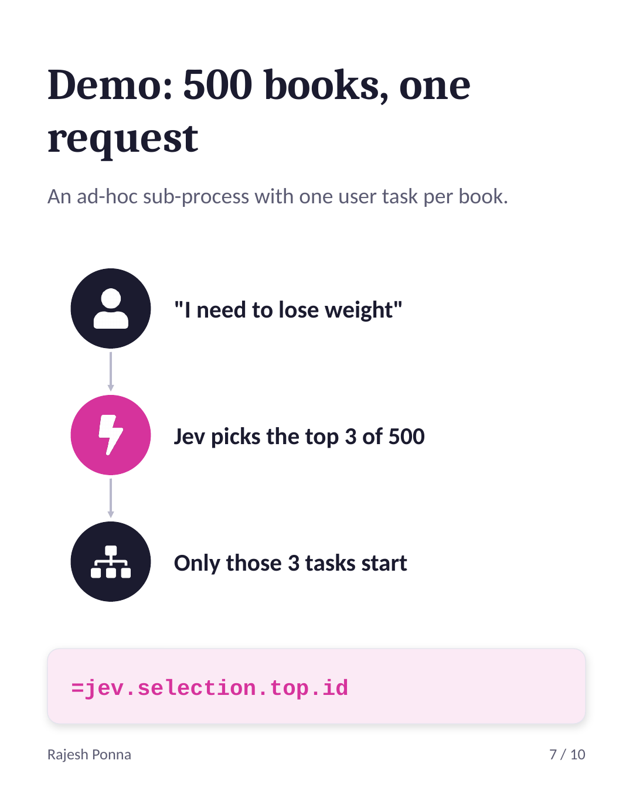
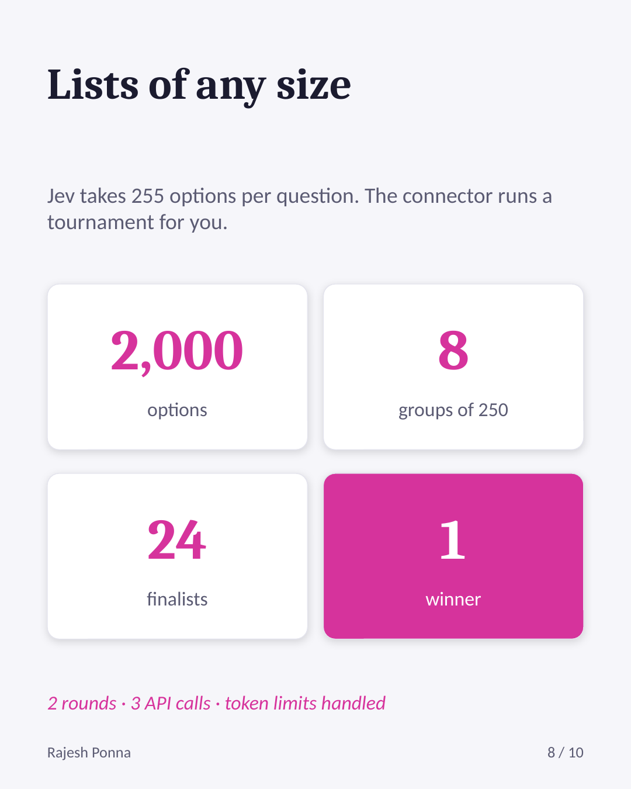

# Jev AI Decision Connector for Camunda 8

Make fast, typed AI decisions inside your BPMN processes with **Jev** by TypeSafe AI.

Route requests, pick the best option from a list, find every matching item, or score and classify
anything, in milliseconds and for a fraction of what a chat LLM costs. The result is structured
data your gateways and ad-hoc sub-processes can use directly, with no prompt parsing and no JSON
repair.

> This is a community connector. It is not an official Camunda or TypeSafe AI product.

## At a glance

<table>
  <tr>
    <td></td>
    <td></td>
    <td></td>
  </tr>
  <tr>
    <td></td>
    <td></td>
    <td></td>
  </tr>
</table>

Full slide deck: [docs/Jev-AI-Decision-Connector.pptx](docs/Jev-AI-Decision-Connector.pptx)

---

## Contents

- [At a glance](#at-a-glance)
- [What is Jev and TypeSafe AI](#what-is-jev-and-typesafe-ai)
- [LLM vs decision model](#llm-vs-decision-model)
- [Why it costs so much less](#why-it-costs-so-much-less)
- [When to use it, and when not](#when-to-use-it-and-when-not)
- [Features](#features)
- [Operations](#operations)
- [Quick start](#quick-start)
- [Properties reference](#properties-reference)
- [Response structure](#response-structure)
- [Example: book recommendation with an ad-hoc sub-process](#example-book-recommendation-with-an-ad-hoc-sub-process)
- [Large lists](#large-lists)
- [Errors and retries](#errors-and-retries)
- [Cost estimation](#cost-estimation)
- [Security](#security)
- [Limitations](#limitations)
- [Troubleshooting](#troubleshooting)
- [Build from source](#build-from-source)
- [Disclaimer](#disclaimer)

---

## What is Jev and TypeSafe AI

**TypeSafe AI** is an AI lab that came out of stealth in September 2026. **Jev** is its first public
model, released in early access on September 15, 2026.

Jev belongs to a new class of model that TypeSafe calls **System One models**. The name comes from
Daniel Kahneman's distinction between fast, intuitive "System 1" thinking and slow, deliberate
"System 2" reasoning. Chat LLMs are built for System 2 style work: writing, explaining, reasoning
step by step. Jev is built for the other kind: quick judgments that software acts on.

TypeSafe describes Jev as a *frontier-intelligence function call*: unstructured state goes in,
typed probabilistic decisions come out.

In practice you give Jev two things:

1. **State**: any text, object or list, such as a customer email, a support ticket or a user's request.
2. **Questions**: each with a fixed answer type that you define up front.

Jev answers every question in one parallel pass and returns each answer with a probability or
confidence. It never returns free text, so there is nothing to parse.

### The three answer types

| Type | Answers | Example question |
|---|---|---|
| **noul** | A number from 0 to 1 (yes/no strength) | "Does this message convey urgency?" |
| **choice** | One option from a list you provide (up to 255) | "Which team should handle this?" |
| **score** | A weighted level on a scale you define (2 to 10 levels) | "How frustrated is the customer?" |

### Why it matters for process automation

Most decisions inside a business process are not essays. They are branches: approve or reject,
which team, which product, how urgent. Until now, making those branches "smart" meant calling a
chat LLM, waiting seconds, paying for generated text, and then hoping the output parses.

A decision model fits BPMN naturally. A gateway needs a value, not a paragraph. Jev gives you that
value, typed and with a confidence you can route on, fast enough to sit in the middle of a
high-volume process.

---

## LLM vs decision model

| | Chat LLM (GPT, Claude, Llama...) | Decision model (Jev) |
|---|---|---|
| **Output** | Free text, generated token by token | Typed answers: a number, an option, a level |
| **Answer space** | Open-ended | Fixed by you in advance |
| **Confidence** | Not reliably available | Calibrated probability on every answer |
| **Parsing** | Needed; output can be malformed | None; the answer already has the right type |
| **Invalid answers** | Possible (a label you never offered, broken JSON) | Not possible; only your defined options are returned |
| **Speed** | Seconds, grows with answer length | Tens to hundreds of milliseconds |
| **Cost** | Input tokens and output tokens | Input tokens only (output is free) |
| **Multiple questions** | Usually one call per question, or one long answer | Many questions answered in one parallel pass |
| **Best at** | Writing, summarizing, explaining, coding, multi-step reasoning | Classifying, routing, choosing, scoring, filtering |
| **Explains itself** | Yes | No, it only returns the decision |

They are partners more than competitors. A common pattern is to let Jev decide quickly and
cheaply, and only call an LLM when you actually need written text, for example to draft the reply
after Jev has routed the ticket.

---

## Why it costs so much less

A chat LLM produces its answer one token at a time. Each output token is a separate step through
the model, and output tokens are usually billed at a higher price than input tokens. Even a
one-word answer often comes with extra tokens, and several questions mean several calls or a
longer generated answer.

Jev skips generation entirely:

1. **No output tokens.** It scores your predefined answers instead of writing text, and TypeSafe
   does not bill for output.
2. **One pass for all questions.** Ten questions about the same state are answered together, and
   the state is read once.
3. **Small, fixed answer space.** Choosing among known options is a much smaller job than
   generating open text.

**TypeSafe pricing (at the time of writing):** $0.042 per million input tokens, output free.
Check typesafe.ai for current prices.

TypeSafe reports Jev running roughly 40 to 200 times faster and 40 to 400 times cheaper than
frontier LLMs on comparable decision tasks. These are vendor figures, so measure on your own data.

### Example

Routing 1,000,000 support tickets of about 500 tokens each (500 million input tokens):

| | Cost |
|---|---|
| Jev | 500 × $0.042 = **about $21** |
| An LLM at $1 per million input tokens, plus ~20 output tokens per ticket at $4 per million | about $500 + $80 = **about $580** |

LLM prices vary widely by model, so plug in your own numbers. The shape of the result stays the
same: with Jev you only pay to read the input.

---

## When to use it, and when not

### Good fits

- **Routing and triage**: which team, which queue, which workflow path.
- **Picking from a catalog**: best product, book, document template or next action for a request.
- **Filtering**: every item in a list that matches a request.
- **Classification and tagging**: category, sentiment, language, intent.
- **Scoring**: urgency, risk, frustration, lead quality.
- **Guardrails**: "Is this request safe to automate?", "Does this reply contain personal data?"
- **High volume or low latency**: thousands of decisions per hour, or a user waiting on the result.
- **Ad-hoc sub-processes**: choosing which activities to start based on the user's request.

### Not a fit

- Writing emails, summaries, reports or any text a person will read.
- Code generation.
- Chat and conversation.
- Open-ended questions where you cannot list the possible answers.
- Tasks that need a written explanation of *why* (Jev returns decisions, not reasons).
- Deep multi-step reasoning or math.

**Rule of thumb:** if you can write the question as "which of these?", "how much?" or "yes or no?",
use Jev. If the answer has to be written, use an LLM.

---

## Features

- Three operations: pick the best option, find all matches, or ask your own questions.
- **Lists of any size.** Choice questions are limited to 255 options; the connector runs a
  tournament across groups automatically, so 500, 2,000 or 50,000 options just work.
- **Token-aware batching.** Requests are split to stay inside Jev's context window.
- **Parallel calls** for large lists.
- **Confidence routing.** `needsReview` flags low-confidence decisions for a human.
- **Full traceability.** Every response includes process instance key, element id, model version,
  token usage, duration and a request id.
- **Retries built in.** Rate limits and server errors are retried with backoff.
- **Camunda secrets** for the API key.
- Clean properties panel with sections for Authentication, Operation, Payload and more.

---

## Operations

| Operation | Use it for | Result |
|---|---|---|
| **Choice: pick the best option** | "I need to lose weight" → best book | `jev.selection.id`, `jev.selection.top` |
| **Noul: find all matching options** | "books that help me sleep" → every match | `jev.filter.matches` |
| **Custom questions** | your own noul / choice / score questions | `jev.answers.<questionId>` |

---

## Quick start

### Requirements

- Camunda 8.9 Self-Managed (Docker Compose) or a compatible connectors runtime
- Java 21 and Maven, to build
- A TypeSafe API key

### 1. Build

```bash
mvn clean package
```

This produces:

- `target/jev-ai-decision-connector-1.2.0.jar`: plain jar for the Camunda connectors runtime
- `target/jev-ai-decision-connector-1.2.0-exec.jar`: standalone runtime for local testing

### 2. Add your API key as a secret

Camunda 8.9 only exposes environment variables that start with `SECRET_` as connector secrets.
In `connector-secrets.txt` (next to your `docker-compose.yaml`):

```
SECRET_TYPESAFE_API_KEY=your_api_key
```

The connector field keeps `{{secrets.TYPESAFE_API_KEY}}`. The runtime adds the prefix itself.

### 3. Load the jar into the connectors container

In `docker-compose.yaml`, under the `connectors` service:

```yaml
    environment:
      - LOADER_PATH=/opt/custom
    env_file: connector-secrets.txt
    volumes:
      - ./jev-ai-decision-connector-1.2.0.jar:/opt/custom/jev-ai-decision-connector.jar
```

Then recreate the container:

```bash
docker compose up -d --force-recreate connectors
docker compose logs connectors | grep -i jev
```

You should see the connector registered with type `io.github.rajeshponna:jev-ai-decision:1`.

**Alternative:** `docker build -t jev-connectors .` with the included `Dockerfile`, and use that
image instead of `camunda/connectors-bundle`.

### 4. Import the element template

- **Desktop Modeler:** copy `element-templates/jev-ai-decision-connector.json` into the
  `resources/element-templates` folder and restart Modeler.
- **Web Modeler:** upload the file to your project and click **Publish**.

### 5. Use it

Add a service task, click **Template → Select**, and choose **Jev AI Decision Connector**.

---

## Properties reference

### Authentication

| Field | Description |
|---|---|
| TypeSafe API key | Default `{{secrets.TYPESAFE_API_KEY}}`. Do not paste the real key here. |
| Organization ID | Optional. Not sent to Jev (the API has no organization concept). Returned in the response for tracking. |
| API endpoint | Default `https://api.typesafe.ai`. Change only for a proxy. |

### Operation

Choice, Noul or Custom questions.

### Payload

| Field | Operations | Description |
|---|---|---|
| Model | all | `jev-latest`, or a pinned model for stable results |
| State | all | What Jev evaluates, e.g. `=prompt` |
| Options | Choice, Noul | List of `{id, name, type?, description?}` of any size |
| Instructions | Choice, Noul | The question. For Noul, refer to the current option as `` `item` `` |
| Top N | Choice | How many ranked results to return |
| Noul threshold | Noul | 0 to 1; options at or above are returned (default 0.5) |
| Max matches | Noul | Optional cap on returned matches |
| Questions | Custom | FEEL context: `questionId → {type, instructions, criteria}` |
| Minimum confidence | Choice, Custom | Below this, `needsReview = true` |

### Large lists (advanced, optional)

| Field | Default | Description |
|---|---|---|
| Group size | 250 | Options per choice question (max 254) |
| Finalists per group | 3 | Top options per group kept for the next round |
| Questions per API call | 4 (Choice), 50 (Noul) | Questions batched into one request |
| Max tokens per API call | 20000 | Requests are split to stay under this |
| Parallel API calls | 4 | Concurrent requests per round |
| Max options | 50000 | Safety cap on list size |

### Response mapping, Error handling, Retries

Result variable (default `jev`), Result expression, Connection timeout (seconds), Error expression,
Retries, Retry backoff. These work like any Camunda connector.

---

## Response structure

The result variable always has the same shape. Only one of `selection`, `filter` or `answers` is
filled, depending on the operation.

```json
{
  "context": {
    "schemaVersion": 1,
    "state": "COMPLETED",
    "metadata": {
      "organizationId": "org_123",
      "processDefinitionKey": 2251799813694141,
      "processInstanceKey": 2251799813694142,
      "bpmnProcessId": "book-recommendation",
      "processDefinitionVersion": 5,
      "elementId": "Task_Jev",
      "elementInstanceKey": 2251799813694314
    },
    "metrics": {
      "modelCalls": 1,
      "tokenUsage": { "inputTokenCount": 701, "outputTokenCount": 200, "totalTokenCount": 901 },
      "durationMs": 1259
    },
    "call": {
      "requestId": "468b66ed-...",
      "operation": "select",
      "requestedModel": "jev-latest",
      "modelId": "jev-1.13.0",
      "questionIds": null,
      "httpStatus": 200,
      "requestTimestamp": "2026-09-29T07:03:27.521Z",
      "responseTimestamp": "2026-09-29T07:03:28.784Z"
    }
  },
  "selection": {
    "id": "Eat_to_Live",
    "name": "Eat to Live by Joel Fuhrman. ...",
    "type": "Health & Wellness",
    "probability": 0.92,
    "confidence": 0.91,
    "top": [ { "id": "Eat_to_Live", "name": "...", "type": "Health & Wellness", "probability": 0.92 } ],
    "itemsTotal": 500,
    "rounds": [
      { "round": 1, "candidates": 500, "groups": 2, "calls": 2 },
      { "round": 2, "candidates": 6, "groups": 1, "calls": 1 }
    ]
  },
  "filter": null,
  "answers": null,
  "needsReview": false,
  "responseText": "selected Eat_to_Live from 500 items in 2 round(s), confidence 0.91"
}
```

**Noul** fills `filter`:

```json
"filter": {
  "matches": [ { "id": "Why_We_Sleep", "name": "...", "type": "Health & Wellness", "score": 0.97 } ],
  "matchCount": 1,
  "threshold": 0.5,
  "itemsTotal": 500
}
```

**Custom questions** fill `answers`:

```json
"answers": {
  "department": { "type": "choice", "value": "billing", "confidence": 0.81, "probabilities": { "billing": 0.88, "technical": 0.12 } },
  "is_urgent":  { "type": "noul",   "value": 0.95, "confidence": null }
}
```

### Useful FEEL expressions

| Need | Expression |
|---|---|
| Best option id | `=jev.selection.id` |
| Top N ids | `=jev.selection.top.id` |
| All matching ids | `=jev.filter.matches.id` |
| A custom answer | `=jev.answers.department.value` |
| Route to a person | `=jev.needsReview` |
| Every option in the chosen category | `=for b in books[type = jev.selection.type] return b.id` |

---

## Example: book recommendation with an ad-hoc sub-process

A user types a request, and the process starts the user tasks for the best-matching books.

```
Start → Prompt form → Fetch ad-hoc tasks → Jev (Choice) → Ad-hoc sub-process (500 book tasks) → End
```

1. **Model each book as a user task** inside the ad-hoc sub-process:
    - **ID**: the book, e.g. `Eat_to_Live`
    - **Name**: the genre, e.g. `Health & Wellness`
    - **Documentation**: a short description, e.g. `Eat to Live by Joel Fuhrman. A plant-heavy eating plan...`
2. **Fetch ad-hoc tasks**: a small job worker reads the deployed BPMN and returns
   `books = [{id, name, type}]` (id from the task ID, name from Documentation, type from Name).
   Jev runs *before* the ad-hoc sub-process, so it cannot use `adHocSubProcessElements`.
3. **Jev task**: Operation *Choice*, State `=prompt`, Options `=books`, Top N `3`.
4. **Ad-hoc sub-process**: Active elements collection `=jev.selection.top.id`.

For "I need to lose weight", Jev picks the three closest books and only those user tasks start.

---

## Large lists

Jev accepts at most 255 options in one choice question and 32k tokens per call. The connector
handles both for you:

1. Options are split into groups of up to 250 (same type kept together) and sized to the token budget.
2. Each group becomes one choice question; several groups share one API call; calls run in parallel.
3. The top 3 of each group move to the next round.
4. Repeat until the finalists fit in one question, then one final question picks the winner.

| Options | Rounds | API calls |
|---|---|---|
| 255 | 1 | 1 |
| 500 | 2 | 2 to 3 |
| 2,000 | 2 | 3 |
| 10,000 | 2 | 11 |
| 50,000 | 3 | 52 |

**Noul** asks one yes/no question per option, 50 per call, 4 calls in parallel.

Every option is sent once in the first round, so cost grows linearly with the list, not with the
number of rounds.

---

## Errors and retries

| Code | When |
|---|---|
| `JEV_UNAUTHORIZED` | Wrong or missing API key (401) |
| `JEV_INVALID_REQUEST` | Jev rejected the request (422) |
| `JEV_INVALID_INPUT` | Bad input, caught before calling Jev (e.g. Options is not a list) |
| `JEV_ERROR` | Other API errors |

Rate limits (429), overload (529) and server errors (5xx) are retried inside the call after
1s, 2s and 4s (honoring `Retry-After`). If they still fail, the job fails and Camunda retries it
with the template's retries and backoff.

Map codes to BPMN errors in **Error expression**, for example:

```
=if error.code = "JEV_UNAUTHORIZED" then bpmnError("JEV_AUTH", error.message) else null
```

---

## Cost estimation

Every response reports `jev.context.metrics.tokenUsage.inputTokenCount`. Run one instance, then:

```
cost per run   = inputTokenCount / 1,000,000 × $0.042
cost of N runs = cost per run × N
```

Rough guide (500 test runs):

| Test | Cost |
|---|---|
| Simple routing (1 short question) | about $0.01 |
| Choice over 500 options | about $0.25 |
| Noul over 500 options | about $0.63 |
| Choice over 2,000 options | about $0.84 |
| Noul over 2,000 options | about $2.50 |

Long option descriptions cost more. Keep them to one sentence.

---

## Security

- Keep the API key in Camunda secrets (`SECRET_TYPESAFE_API_KEY`). A key typed into the properties
  panel is stored in the BPMN file and visible in Operate.
- Never commit `connector-secrets.txt`. Add it to `.gitignore`.
- If a key is ever exposed (screenshots, chat, a pushed BPMN file), delete it in the TypeSafe console
  and create a new one.
- State and options are sent to TypeSafe's API. Check your data policies before sending personal
  or sensitive data.

---

## Limitations

- Jev is in **early access**. Availability, pricing and models may change, and signups may be limited.
- Jev returns decisions, not explanations. Pair it with an LLM when you need written text.
- Organization ID is for tracking only and is not sent to TypeSafe.
- In the tournament, the final confidence comes from the last round.
- Rounds keep the top 3 per group; a correct option that ranks 4th inside its group is dropped.
  Raise **Finalists per group** if that matters for your data.
- Accuracy depends on how well your options are described. Short, distinctive descriptions work best.

---

## Troubleshooting

| Symptom | Cause | Fix |
|---|---|---|
| Task waits forever, no incident | Jar not loaded by the runtime | Mount it in `LOADER_PATH` (e.g. `/opt/custom`), recreate the container, check logs |
| `Secret with name 'TYPESAFE_API_KEY' is not available` | Camunda 8.9 secret prefix | Use `SECRET_TYPESAFE_API_KEY=...` in `connector-secrets.txt`, recreate the container |
| `Cannot construct instance of LinkedHashMap ... from String` | Options is text, not a list | Set Options to a list, e.g. `=books` |
| Properties panel shows raw Input mapping | Template not applied | Template → Select → Jev AI Decision Connector |
| Ad-hoc sub-process fails with `=jev` | Active elements needs a list of ids | Use `=jev.selection.top.id` or `=jev.filter.matches.id` |
| `JEV_UNAUTHORIZED` | Wrong or revoked key | Check the secret value, recreate the container |

---

## Build from source

```
camunda-jev-ai-decision-connector/
├── README.md
├── LICENSE
├── pom.xml
├── Dockerfile
├── element-templates/
│   └── jev-ai-decision-connector.json
├── src/main/java/io/github/rajeshponna/jev/
│   ├── JevConnectorFunction.java   entry point, operations
│   ├── CatalogSelector.java        tournament for large choice lists
│   ├── CatalogFilter.java          noul filtering
│   ├── JevClient.java              HTTP, retries, token budget
│   ├── JevRequest.java             input binding
│   └── JevResponse.java            response model
├── example-bpmn/
│   ├── jev.bpmn                    book recommendation process
│   ├── prompt.form                 form for the user's request
│   └── JobWorkerToGetListOfUSerTaskInAdocSubProcess.java   fetch-adhoc-tasks worker
└── docs/
    ├── Jev-AI-Decision-Connector.pptx
    └── images/                     slides used in this README
```

```bash
mvn clean package
```

Set `version.connectors` in `pom.xml` to your Camunda version.

---

## Disclaimer

This is an independent community project. It is not affiliated with, endorsed by or supported by
TypeSafe AI or Camunda. "Jev" and "TypeSafe" are trademarks of their respective owners. Performance
and pricing figures above are published by TypeSafe AI or third parties; verify them against your
own workloads and the current TypeSafe documentation.

## License

Apache License 2.0. See `LICENSE`.

## Author

Rajesh Ponna · [github.com/rajeshponna](https://github.com/rajeshponna)